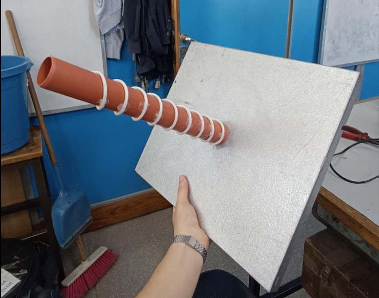
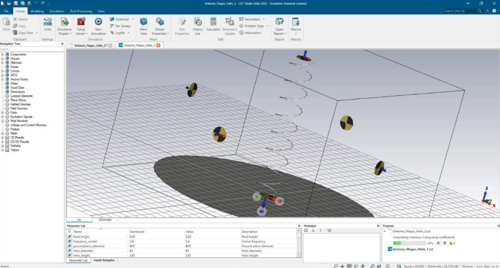
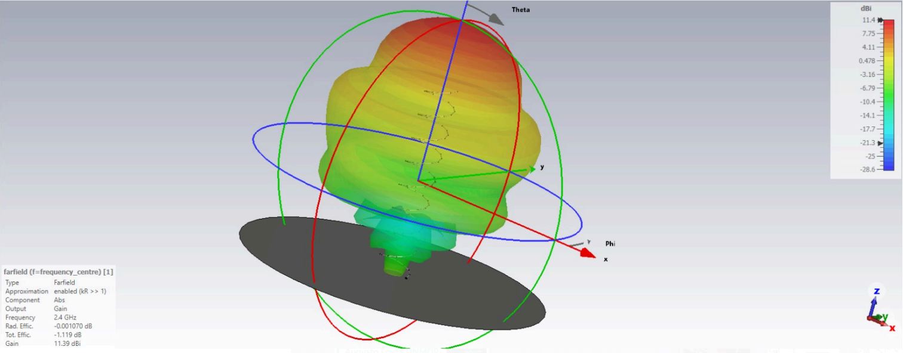
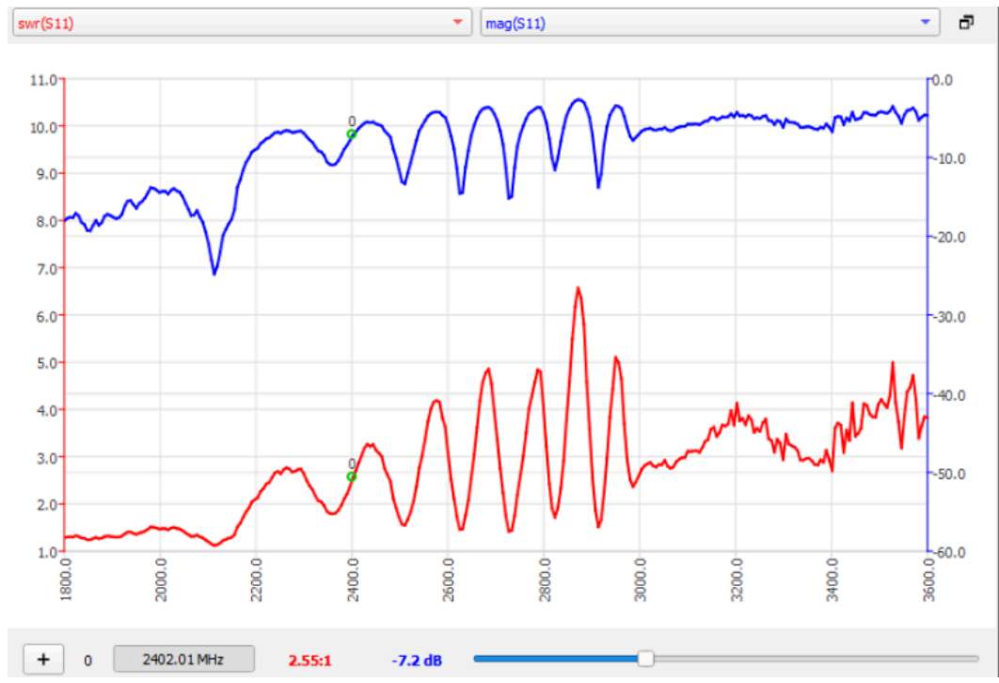
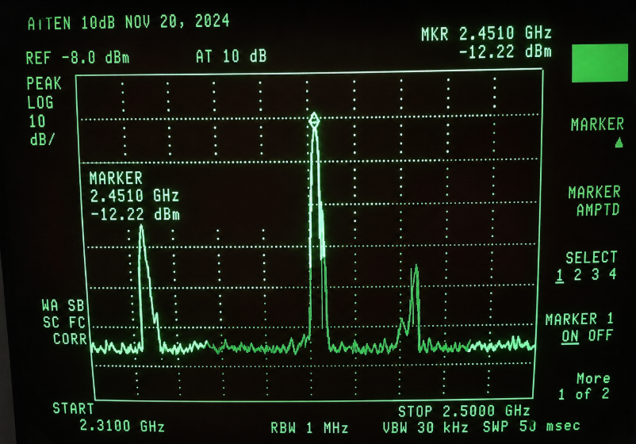

# RHCP Helical Antenna for the 2.4 GHz Band

Design, simulation and experimental validation of a low-cost RHCP helical antenna for operation in the 2.4 GHz band.

This project was developed as a final assignment for the **Medios de Transmisión** course in the Electronic Engineering program at the **Universidad Nacional de Mar del Plata**.

## Overview

The objective of this project was to design and build a low-cost helical antenna with **Right Hand Circular Polarization (RHCP)**, intended for wireless communication applications in the 2.4 GHz band, including Wi-Fi, Bluetooth and possible satellite reception scenarios.

The work included:

- Antenna parameter calculation
- Physical implementation of the helical structure
- Impedance matching to 50 Ω using a λ/4 matching section
- Electromagnetic simulation using CST Studio Suite and Antenna Magus
- S11 analysis
- Radiation pattern analysis
- Experimental validation using a Vector Network Analyzer and spectrum analyzer

## Antenna Design

The antenna was designed for a target frequency of **2.4 GHz**. The main design parameters were:

| Parameter | Value |
|---|---|
| Target frequency | 2.4 GHz |
| Polarization | RHCP |
| Number of turns | 8 |
| Internal helix diameter | 40 mm |
| Conductor diameter | 1 mm |
| Total antenna length | 25 cm |
| Matching section length | 3.12 cm |
| Reflector size | 40 cm × 35 cm |

## Implementation

The prototype was built using low-cost and easily available materials:

- PVC tube
- Coaxial cable
- Metallic reflector
- Copper strip
- RF connector
- Soldering tools

The helix was wound around the PVC support and mounted over a metallic ground plane. A λ/4 matching section was implemented to improve impedance matching with the 50 Ω measurement system.

## Electromagnetic Simulation

The antenna was simulated using **CST Studio Suite** and **Antenna Magus** in order to estimate its input reflection coefficient and far-field radiation pattern.

The simulated far-field results showed a directional radiation pattern with a main lobe centered around 0°.

Main simulated results:

| Result | Value |
|---|---|
| Simulated operating band | 2.5 GHz to 3.5 GHz |
| Maximum theoretical gain | 11.4 dBi |
| Main lobe angle | 0° |
| S11 at 3 GHz | -17 dB |
| Minimum simulated S11 | -24.5 dB at 3.05 GHz |

## Measurements

The antenna was characterized using a **Vector Network Analyzer** to evaluate the reflection coefficient.

The measured S11 showed a main minimum around **2.1 GHz**, with secondary dips between **2.3 GHz and 2.9 GHz**. At 2.4 GHz, the measured S11 was approximately **-7.2 dB**.

The antenna was also connected to a spectrum analyzer to verify reception of a Bluetooth signal.

A received signal peak was observed around **2.46 GHz**, with a measured power of approximately **-12.27 dBm**, confirming that the prototype was able to receive signals within the target band.

## Conclusions

The project demonstrated the feasibility of designing and building a low-cost RHCP helical antenna for the 2.4 GHz band.

Although the measured impedance matching was not optimal at exactly 2.4 GHz, the antenna showed functional performance across a frequency range that includes Wi-Fi and Bluetooth operation. The differences between simulation and measurement were mainly attributed to construction tolerances, matching section imperfections, spacing between turns, material effects and interaction with the reflector.

## Tools and Equipment

- CST Studio Suite
- Antenna Magus
- Vector Network Analyzer
- Spectrum Analyzer
- RF connectorized measurement setup

## Skills Applied

- RF design
- Antenna design
- S-parameter analysis
- Impedance matching
- Electromagnetic simulation
- Spectrum analysis
- Experimental RF measurements

## Authors

- Lucas Starita
- Augusto Loyza

## Institution

Faculty of Engineering  
Universidad Nacional de Mar del Plata  
Course: Medios de Transmisión
